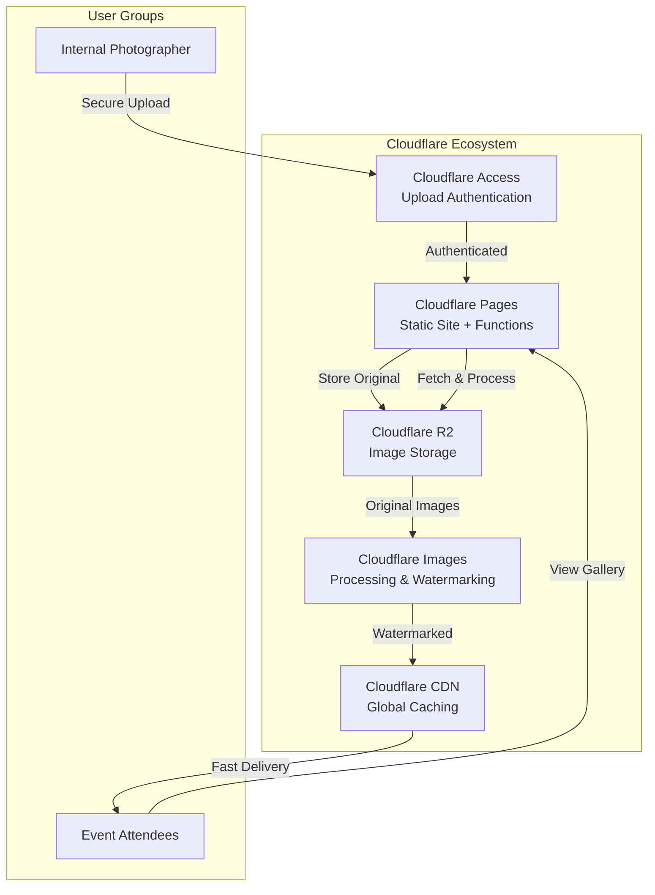
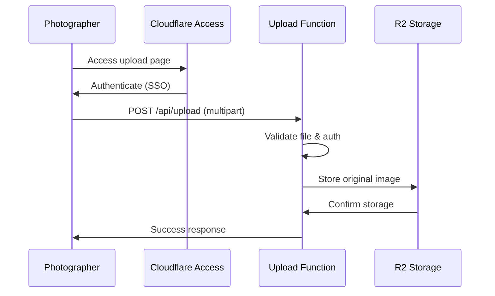
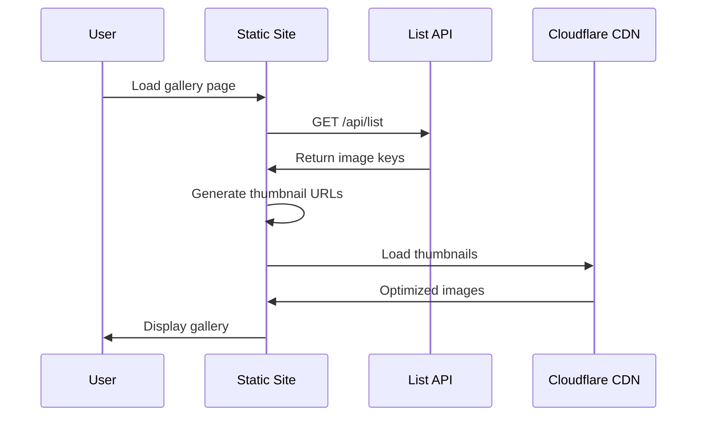
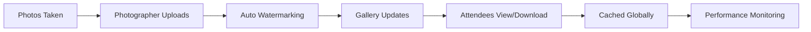

# BBFF & HMB Brewing Co. Photo Sharing Site - Implementation Plan

## Project Overview

This document outlines the complete implementation plan for a serverless photo sharing solution using Cloudflare's ecosystem for the Half Moon Bay Brewing Company's 25th Anniversary event. The solution features automatic watermarking, secure uploads, and a public gallery with comprehensive testing and documentation.

## Architecture Overview



## Technical Stack

- **Frontend**: HTML5, CSS3, TypeScript/JavaScript
- **Backend**: Cloudflare Pages Functions (TypeScript)
- **Storage**: Cloudflare R2 (S3-compatible)
- **Image Processing**: Cloudflare Images API
- **Authentication**: Cloudflare Access
- **Testing**: Vitest, Playwright
- **Documentation**: JSDoc, Markdown

## Project Structure

```
bbff-photo-site/
├── __tests__/                    # Unit and integration tests
│   ├── unit/
│   │   ├── upload.test.ts
│   │   ├── list.test.ts
│   │   └── images.test.ts
│   ├── integration/
│   │   └── workflow.test.ts
│   └── e2e/
│       └── gallery.spec.ts
├── docs/                         # Documentation
│   ├── api.md
│   ├── deployment.md
│   ├── troubleshooting.md
│   └── event-day-guide.md
├── public/                       # Frontend assets
│   ├── index.html
│   ├── upload.html
│   ├── styles/
│   │   ├── main.css
│   │   └── responsive.css
│   ├── scripts/
│   │   ├── gallery.ts
│   │   ├── upload.ts
│   │   └── utils.ts
│   └── assets/
│       ├── logos/
│       └── branding/
├── functions/                    # Backend functions
│   ├── api/
│   │   ├── upload.ts
│   │   ├── list.ts
│   │   └── images/
│   │       └── [key].ts
│   └── _middleware.ts
├── src/                         # Shared utilities
│   ├── types/
│   │   └── index.ts
│   └── utils/
│       ├── validation.ts
│       ├── image-processing.ts
│       └── error-handling.ts
├── wrangler.toml                # Cloudflare configuration
├── package.json                 # Dependencies and scripts
├── tsconfig.json               # TypeScript configuration
├── vitest.config.ts            # Testing configuration
├── playwright.config.ts        # E2E testing configuration
├── .eslintrc.js               # Code quality rules
├── .prettierrc                # Code formatting
├── README.md                  # Comprehensive documentation
└── .gitignore                 # Git ignore rules
```

## Implementation Phases

### Phase 1: Cloudflare Account & Service Setup (Day 1)

#### 1.1 Cloudflare Account Setup
- [ ] Create Cloudflare account at [cloudflare.com](https://cloudflare.com)
- [ ] Add domain (or use provided Cloudflare subdomain)
- [ ] Configure DNS settings if using custom domain
- [ ] Enable required Cloudflare services

#### 1.2 R2 Storage Setup
- [ ] Navigate to R2 Object Storage in Cloudflare Dashboard
- [ ] Create bucket: `hmbbrew-25th-photos`
- [ ] Generate R2 API tokens (Access Key ID & Secret Access Key)
- [ ] Configure CORS policy for web uploads:
  ```json
  {
    "AllowedOrigins": ["https://your-domain.com"],
    "AllowedMethods": ["GET", "PUT", "POST", "DELETE"],
    "AllowedHeaders": ["*"],
    "ExposeHeaders": ["ETag"],
    "MaxAgeSeconds": 3600
  }
  ```
- [ ] Set up bucket structure: `25thAnniversary/` prefix

#### 1.3 Cloudflare Images Setup
- [ ] Enable Image Resizing in Speed > Optimization
- [ ] Configure Images service for watermarking
- [ ] Create KV namespace for branding assets: `BRANDING_ASSETS`
- [ ] Upload logos to KV store:
  - `bbff-logo.png` (BBFF logo)
  - `hmb-logo.png` (HMB Brewing logo)

#### 1.4 Cloudflare Access Setup
- [ ] Navigate to Zero Trust Dashboard
- [ ] Create Access Application for upload routes (`/upload`, `/api/upload`)
- [ ] Configure authentication provider (Google, GitHub, etc.)
- [ ] Set up access policies for internal team emails
- [ ] Test authentication flow

### Phase 2: Development Environment Setup (Day 1-2)

#### 2.1 Local Development Setup
- [ ] Install Node.js (18+) and npm
- [ ] Install Wrangler CLI: `npm install -g wrangler`
- [ ] Authenticate Wrangler: `wrangler login`
- [ ] Initialize project: `npm init -y`

#### 2.2 Development Dependencies
```json
{
  "devDependencies": {
    "@types/node": "^20.0.0",
    "@typescript-eslint/eslint-plugin": "^6.0.0",
    "@typescript-eslint/parser": "^6.0.0",
    "eslint": "^8.0.0",
    "prettier": "^3.0.0",
    "typescript": "^5.0.0",
    "vitest": "^1.0.0",
    "playwright": "^1.40.0",
    "@cloudflare/workers-types": "^4.0.0"
  },
  "dependencies": {
    "fancybox": "^5.0.0"
  }
}
```

#### 2.3 Configuration Files
- [ ] Create `wrangler.toml` with R2 and KV bindings
- [ ] Configure `tsconfig.json` for strict TypeScript
- [ ] Set up ESLint and Prettier configurations
- [ ] Create Vitest configuration for testing

### Phase 3: Backend Implementation (Day 2-3)

#### 3.1 Upload Handler (`functions/api/upload.ts`)



**Key Features:**
- Multipart form data handling
- File type validation (JPEG, PNG, WebP)
- File size limits (max 10MB)
- Unique filename generation
- Error handling and logging
- Progress tracking

#### 3.2 Image Listing Handler (`functions/api/list.ts`)
- [ ] Fetch all objects from R2 with `25thAnniversary/` prefix
- [ ] Handle pagination for large datasets
- [ ] Return JSON array of image metadata
- [ ] Implement minimal caching (30 seconds)
- [ ] Sort by upload date (newest first)

#### 3.3 Image Serving Handler (`functions/api/images/[key].ts`)
- [ ] Fetch original from R2 storage
- [ ] Apply watermarks using Cloudflare Images API
- [ ] Implement multi-level caching strategy
- [ ] Handle different image sizes (thumbnail, medium, full)
- [ ] Generate responsive image variants

**Watermarking Specifications:**
- BBFF logo: top-left, 100x100px, 80% opacity
- HMB Brewing logo: bottom-right, 100x100px, 80% opacity
- Maintain aspect ratios and image quality
- Cache processed images for 7 days

### Phase 4: Frontend Implementation (Day 3-4)

#### 4.1 Gallery Interface (`public/index.html`)
- [ ] Responsive grid layout (2-4 columns based on screen size)
- [ ] Lazy loading implementation for performance
- [ ] Lightbox integration (Fancybox)
- [ ] Download functionality
- [ ] Search and filter capabilities
- [ ] Infinite scroll or pagination

#### 4.2 Upload Interface (`public/upload.html`)
- [ ] Drag-and-drop interface
- [ ] Multiple file selection
- [ ] Upload progress indicators
- [ ] Preview before upload
- [ ] Batch upload capabilities
- [ ] Success/error feedback

#### 4.3 Branding Integration
- [ ] Implement BBFF/HMB color scheme
- [ ] Add event logos to header
- [ ] Match typography from existing sites
- [ ] Responsive design for mobile/desktop
- [ ] Accessibility compliance (WCAG 2.1)

#### 4.4 Dynamic Content Loading



### Phase 5: Advanced Features (Day 4)

#### 5.1 Image Processing Features
- [ ] Multiple image formats support
- [ ] Automatic image optimization
- [ ] EXIF data handling
- [ ] Image rotation correction
- [ ] Quality-based serving

#### 5.2 Performance Optimizations
- [ ] Service Worker implementation
- [ ] Offline capability
- [ ] Preloading strategies
- [ ] Image compression pipeline
- [ ] CDN optimization

### Phase 6: Quality Assurance Setup (Day 5)

#### 6.1 Code Quality Configuration
- [ ] ESLint rules for TypeScript
- [ ] Prettier formatting rules
- [ ] Pre-commit hooks with Husky
- [ ] Code coverage reporting
- [ ] Static analysis tools

#### 6.2 Error Handling & Logging
- [ ] Comprehensive error boundaries
- [ ] Structured logging with levels
- [ ] Error reporting to Cloudflare Analytics
- [ ] User-friendly error messages
- [ ] Fallback mechanisms

### Phase 7: Deployment & Infrastructure (Day 5-6)

#### 7.1 Cloudflare Pages Configuration
- [ ] Connect GitHub repository
- [ ] Configure build settings
- [ ] Set environment variables
- [ ] Configure custom domain
- [ ] Set up SSL certificates

#### 7.2 Environment Configuration
```toml
# wrangler.toml
name = "bbff-photo-site"
compatibility_date = "2024-01-01"

[env.production]
vars = { ENVIRONMENT = "production" }

[[env.production.r2_buckets]]
binding = "PHOTOS_BUCKET"
bucket_name = "hmbbrew-25th-photos"

[[env.production.kv_namespaces]]
binding = "BRANDING_ASSETS"
id = "your-kv-namespace-id"
```

#### 7.3 Security Configuration
- [ ] Content Security Policy headers
- [ ] CORS configuration
- [ ] Rate limiting setup
- [ ] Access control validation
- [ ] Security headers implementation

### Phase 8: Testing & Documentation (Day 6-7)

#### 8.1 Unit Testing
- [ ] Upload function tests
- [ ] Image processing tests
- [ ] Authentication tests
- [ ] Error handling tests
- [ ] Utility function tests

**Test Coverage Requirements:**
- Minimum 90% code coverage
- All critical paths tested
- Edge cases covered
- Mock external dependencies

#### 8.2 Integration Testing
- [ ] End-to-end upload workflow
- [ ] Image processing pipeline
- [ ] Authentication flow
- [ ] Error scenarios
- [ ] Performance testing

#### 8.3 End-to-End Testing
```typescript
// Example E2E test with Playwright
test('Photo gallery workflow', async ({ page }) => {
  await page.goto('/');
  await expect(page.locator('.photo-grid')).toBeVisible();
  await page.click('.photo-item:first-child');
  await expect(page.locator('.lightbox')).toBeVisible();
});
```

#### 8.4 Documentation Requirements

**README.md Structure:**
- [ ] Project overview and purpose
- [ ] Architecture diagram
- [ ] Prerequisites and setup
- [ ] Local development guide
- [ ] Deployment instructions
- [ ] API documentation
- [ ] Troubleshooting guide
- [ ] Contributing guidelines

**API Documentation (`docs/api.md`):**
- [ ] Upload endpoint specifications
- [ ] Image listing endpoint
- [ ] Image serving endpoint
- [ ] Authentication requirements
- [ ] Error response formats
- [ ] Rate limiting information

**Deployment Guide (`docs/deployment.md`):**
- [ ] Cloudflare account setup
- [ ] Environment configuration
- [ ] DNS configuration
- [ ] SSL certificate setup
- [ ] Monitoring setup

**Event Day Guide (`docs/event-day-guide.md`):**
- [ ] Pre-event checklist
- [ ] Upload workflow for photographers
- [ ] Troubleshooting common issues
- [ ] Performance monitoring
- [ ] Post-event procedures

#### 8.5 Code Documentation
- [ ] JSDoc comments for all functions
- [ ] TypeScript interfaces and types
- [ ] Inline code comments
- [ ] Architecture decision records
- [ ] API endpoint documentation

### Phase 9: Event Preparation & Launch (Day 7-8)

#### 9.1 Final Testing & Validation
- [ ] Full system integration test
- [ ] Performance benchmarking
- [ ] Security validation
- [ ] Mobile responsiveness testing
- [ ] Cross-browser compatibility

#### 9.2 Event-Day Preparation
- [ ] Upload branding assets to production
- [ ] Create photographer accounts in Access
- [ ] Test authentication flows
- [ ] Set up monitoring dashboards
- [ ] Prepare support documentation

## Event-Day Workflow



## Technical Specifications

### Performance Targets
- Gallery load time: < 2 seconds
- Image processing: < 1 second (first time)
- Thumbnail generation: < 500ms
- 99.9% uptime during event
- Support 1000+ concurrent users

### Security Features
- Cloudflare Access for upload protection
- CORS policies for secure uploads
- Rate limiting (100 requests/minute)
- Content Security Policy headers
- Secure token-based authentication

### Scalability Features
- Automatic edge caching
- Global CDN distribution
- Serverless auto-scaling
- Efficient image processing pipeline
- Optimized database queries

## Resource Requirements

### Development Timeline
- **Phase 1-2**: Setup & Configuration (2 days)
- **Phase 3-4**: Backend & Frontend Development (3 days)
- **Phase 5-6**: Advanced Features & QA (2 days)
- **Phase 7-8**: Testing & Documentation (2 days)
- **Phase 9**: Deployment & Launch (1 day)
- **Total**: 8-10 days

### Cloudflare Costs (Estimated)
- R2 Storage: Free tier (10GB) - $0
- Image Processing: Free tier (5,000 transforms) - $0
- Pages Functions: Free tier (100,000 requests) - $0
- Access: Free tier (50 users) - $0
- **Total Monthly Cost**: $0 (within free tiers)

### Team Requirements
- 1 Full-stack Developer
- 1 DevOps/Infrastructure Engineer (part-time)
- 1 QA Engineer (part-time)
- 1 Technical Writer (part-time)

## Success Metrics

### Technical Metrics
- [ ] 90%+ code coverage achieved
- [ ] All E2E tests passing
- [ ] Performance targets met
- [ ] Security vulnerabilities resolved
- [ ] Documentation completeness verified

### Business Metrics
- [ ] Secure upload system operational
- [ ] Automatic watermarking functional
- [ ] Gallery accessible to attendees
- [ ] Download functionality working
- [ ] Event team satisfied with solution

## Risk Mitigation

### Technical Risks
- **Image processing failures**: Implement fallback mechanisms
- **Storage limitations**: Monitor usage and scaling
- **Authentication issues**: Backup authentication methods
- **Performance degradation**: Caching and optimization strategies

### Operational Risks
- **Event-day support**: Dedicated support team
- **User training**: Clear documentation and guides
- **Infrastructure monitoring**: Real-time alerts and dashboards

## Post-Event Considerations

### Data Management
- [ ] Photo archival strategy
- [ ] Backup and recovery procedures
- [ ] Long-term storage costs
- [ ] Data retention policies

### Future Enhancements
- [ ] Multi-event support
- [ ] Advanced analytics
- [ ] Social media integration
- [ ] Mobile app development

## Conclusion

This implementation plan provides a comprehensive roadmap for building a professional-grade photo sharing solution using Cloudflare's ecosystem. The plan emphasizes code quality, thorough testing, and comprehensive documentation while maintaining cost-effectiveness through Cloudflare's free tier services.

The solution will provide HMB Brewing Co. and BBFF with a secure, scalable, and user-friendly platform for sharing event photos with automatic watermarking and global distribution capabilities.

---

*This document should be reviewed and updated as implementation progresses and requirements evolve.*